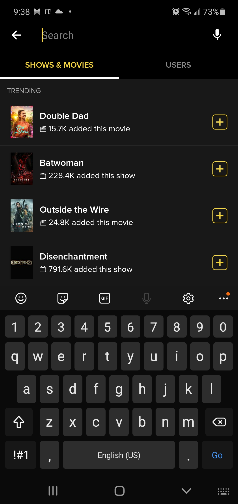

# DGL 114 - Process Portfolio
## By Taiwo Adekanmbi

### Week 1 Activities
**Activity 0101**:
1. **Good app- TV Time**

    **The good**

 - Its search engine is good, not great but adds a lot of niche shows.
 
- Its interface is appealing and convenient with visual display of the shows I added.
 
- It recently added a movie list into it’s app without making a different app for movies which is convenient.  
 
    **The bad**

- It would be nice to category my shows or movies based on genres or any headings I wanted, instead of watching, have not started, up to date, finished, stopped.

2. **Difficult app-Prime Video**

    **Demerit**
- Even when you subscribe there is still ads.
- You can not select a different rotation for prime video.
 
- When you want to change the episode to a random episode, it is not added to the video settings, so you must go back to the beginning of the interface to do so. It only allows you to go to the immediate next episode.
 
    **Benefit**
- It gives you information and pics of the actors of each scene.
 
- It also provides a behind the scenes interview with trivia directly on the video interface.
The videos can be background play

**Activity 0102**:

- **Usable elements**
1.	Context and text should be legible and readable
2.	Generally, core content should be available without internet or with low internet connection 
3.	Screen content and transition should load quickly.
4.	Multi step task should be displayed in modal view.
5.	App should be design with the fully understanding of user in mind through research and observation.
6.	Navigation and key content should be designed for thumbs
7.	Put the key content at the foreground and the main navigation controls should be placed a more appropriate position on the device without blocking the content
8.	Make sure the touch target area is large enough to compensate for the different finger size of individuals.
9.	Display only what matters to the user while provides them with tools to do whatever they need on the app
10.	App should work well on a multiple of platform

- **Intuitive elements**
1.	Create an interface that focuses on necessary elements. Be precise and simple with your elements not scarce.
2.	Make a functional and accessible font and colour.
3.	Follow an established design specification to make the app easier to use
4.	Focus on a smooth navigation and make it touch focused by designing the interface to be big enough for users to tap
5.	Distinguish between the tappable and non-elements either by color or shape. E.g. a tappable link could be blue, while the body of content could remain black.
6.	Discovering new UI function with different icons to instinctively understand their meaning later on.
7.	Provide a short walk through and coach marks of new functions to new users or non tech savvy individual. 

